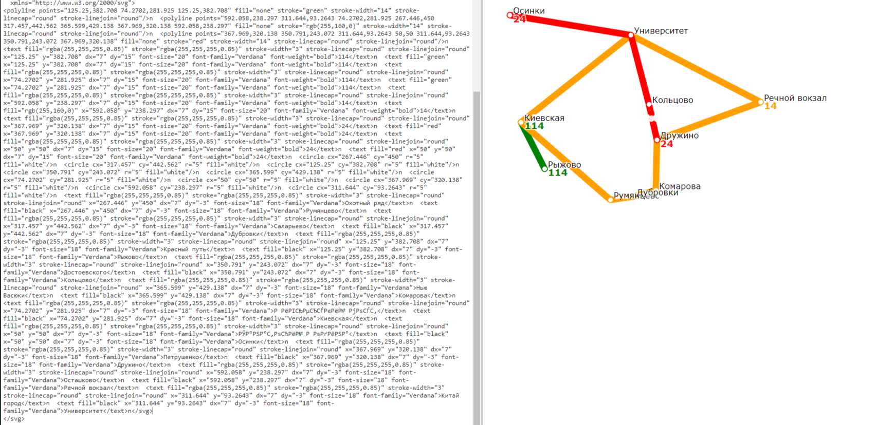

Транспортный справочник.

•	Принимает на вход запросы в формате JSON двух видов: для формирования базы данных и для обработки маршрутов и выдает ответ в виде SVG-файла, визуализирующего остановки и маршруты.

•	Находит кратчайший маршрут между остановками.

•	Для разделения вычислений выполнена сериализация базы данных базы по средством Google Protobuf.

Формат JSON для формирования базы данных:

Установки:

{
  "serialization_settings": {
    "file": "transport_catalogue.db"
  },
  "routing_settings": {
    "bus_wait_time": 2,
    "bus_velocity": 30
  },
  "render_settings": {
    "width": 1200,
    "height": 500,
    "padding": 50,
    "stop_radius": 5,
    "line_width": 14,
    "bus_label_font_size": 20,
    "bus_label_offset": [
      7,
      15
    ],
    "stop_label_font_size": 18,
    "stop_label_offset": [
      7,
      -3
    ],
    "underlayer_color": [
      255,
      255,
      255,
      0.85
    ],
    "underlayer_width": 3,
    "color_palette": [
      "green",
      [
        255,
        160,
        0
      ],
      "red"
    ]
  }

Описание остановок и маршрутов:

"base_requests": [
    {
      "type": "Bus",
      "name": "14",
      "stops": [
        "Улица Лизы Чайкиной",
        "Электросети",
        "Ривьерский мост",
        "Гостиница Сочи",
        "Кубанская улица",
        "По требованию",
        "Улица Докучаева",
        "Улица Лизы Чайкиной"
      ],
      "is_roundtrip": true
    },
    {
      "type": "Bus",
      "name": "24",
      "stops": [
        "Улица Докучаева",
        "Параллельная улица",
        "Электросети",
        "Санаторий Родина"
      ],
      "is_roundtrip": false
    },
    {
      "type": "Bus",
      "name": "114",
      "stops": [
        "Морской вокзал",
        "Ривьерский мост"
      ],
      "is_roundtrip": false
    },
    {
      "type": "Stop",
      "name": "Улица Лизы Чайкиной",
      "latitude": 43.590317,
      "longitude": 39.746833,
      "road_distances": {
        "Электросети": 4300,
        "Улица Докучаева": 2000
      }
    },
    {
      "type": "Stop",
      "name": "Морской вокзал",
      "latitude": 43.581969,
      "longitude": 39.719848,
      "road_distances": {
        "Ривьерский мост": 850
      }
    }
    
Запросы к базе данных:

 
  {
      "serialization_settings": {
          "file": "transport_catalogue.db"
      },
      "stat_requests": [
          {
              "id": 218563507,
              "type": "Bus",
              "name": "14"
          },
          {
              "id": 508658276,
              "type": "Stop",
              "name": "Электросети"
          },
          {
              "id": 1964680131,
              "type": "Route",
              "from": "Морской вокзал",
              "to": "Параллельная улица"
          },
          {
              "id": 1359372752,
              "type": "Map"
          }
      ]
  }
 
 Возможный вывод:
 
[
    {
        "curvature": 1.60481,
        "request_id": 218563507,
        "route_length": 11230,
        "stop_count": 8,
        "unique_stop_count": 7
    },
    {
        "buses": [
            "14",
            "24"
        ],
        "request_id": 508658276
    },
    {
        "items": [
            {
                "stop_name": "Морской вокзал»",
                "time": 2,
                "type": "Wait"
            },
            {
                "bus": "114",
                "span_count": 1,
                "time": 1.7,
                "type": "Bus"
            },
            {
                "stop_name": "Электросети",
                "time": 2,
                "type": "Wait"
            },
            {
                "bus": "14",
                "span_count": 4,
                "time": 6.06,
                "type": "Bus"
            },
            {
                "stop_name": "Параллельная улица",
                "time": 2,
                "type": "Wait"
            },
            {
                "bus": "24",
                "span_count": 1,
                "time": 2.2,
                "type": "Bus"
            }
        ],
        "request_id": 1964680131,
        "total_time": 15.96
    },

